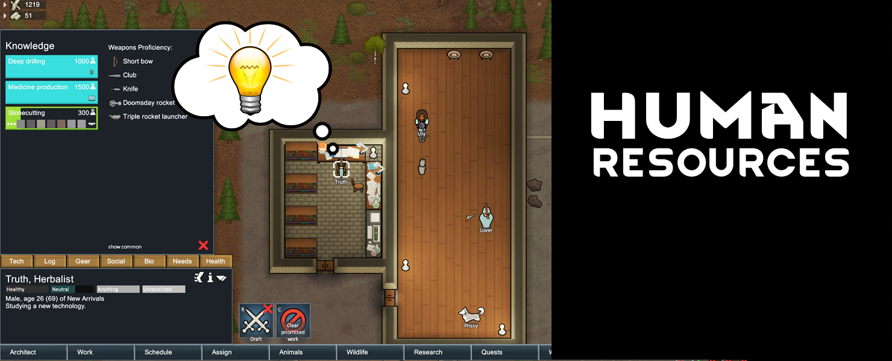

# [JPT] Human Resources - Beta
A technology overhaul for RimWorld 

[**>>> DOWNLOAD IT HERE <<<**](https://github.com/jptrrs/HumanResources/releases/latest)

_So, the brainiac in your colony spent a whole week locked up in his lab and discovered solar power. Great! Now, how exactly does the builder figures out how to actually build the damn solar panels? Or else: your hunter has been using only bow and arrow for his whole life, so how the heck is he going to operate the space-age pulse charger you just gave him? How can someone grow peaches if he's never seen a peach tree before? Craft a full armor set without knowing how to smith? **What if your pawns had to actually learn their stuff before putting a new technology to use?**_

This experimental mod with far-reaching consequences completely changes the way research plays out in the game. No longer some abstract concept, technologies become actual knowledge your pawns need to learn from methodical research, by studying the proper books (yes, you get to build a library!) or, when it comes to weapons skills, to be acquired by arduous training (yes, you get to build a dojo!). Proper knowledge of what they're doing will be mandatory for them to build and repair structures, follow recipes, grow crops and equip weapons. **This will make you care a lot more for your colonists and give you a whole new perspective on recruiting**. It will also raise new obstacles to developing your colony, making the game harder while adding gameplay depth. We hope you're up for the challenge!

#### Warning #1: Not suited to be added mid-game. 
Please, start a new one.

#### Warning #2: This mod relies on [ResearchTree](https://steamcommunity.com/sharedfiles/filedetails/?id=1266570759) (or one of its branches, [ResearchPal](https://steamcommunity.com/sharedfiles/filedetails/?id=946390822) or [ResearchPal - Forked](https://steamcommunity.com/sharedfiles/filedetails/?id=2351393394])). 
If you don't use one of them yet, what are you doing with your life? They're pretty much mandatory mods. Please, choose one and install it. We could have incorporated Fluffy's code into ours, but we'd rather mantain a lean mod and give you an incentive to get to know and support his work.

#### Warning #3: This mod was designed to kick your ass! 
It's supposed to turn RimWorld into something [url=youtu.be/JVI_Mo02auo]like this[/url]. If you can't handle it, maybe it's not for you.

This is how it works:

## Knowledge is **power.**

Every pawn gets a new inspector tab: _Tech_. It displays everything he or she knows: technological expertise on one side and weapons proficiency on the other. Both lists are derived from the current game database, so all modded research projects and weapons are automatically included. Newly generated pawns, including NPCs, are assigned a number of techs based on his faction tech level and his background. That number depends on a pawn's age and faction level: tribals get more and cheaper techs, and the more advanced their starting level is the more specialized they tend to be. This list limits what a pawn can build, repair, grow or craft. To acquire new knowledge, he or she will need to study! That's one of the uses of the new _study desk_.

The weapon proficiency works similarly, limiting what weapons the pawn can equip. Any weapon that's linked to a research project will require the pawn to learn how to use it before equipping. Some simple weapons are exempted, and specially good shooters and brawlers start with better weapon knowledge, as do pawns who know how to craft their own. But all pawns will have to spend some time training at the _training dummy_ or the _target stand_ if they want to wield the latest weapons and stay on top of their game.

## Books are **mandatory.**

Yes, books! This is how humanity stores and shares knowledge and this is how you're going to store and share your technology now. There's a book for every research project on the game (even modded ones), and you can only unlock a technology when you add that book to your library. Of course, this is RimWorld, so finding useful books is not so easy. You can eventually buy them from the **new specialized traders**, but that's expensive and they rarely visit. You can maybe get them as a quest reward too. But mostly you'll have to write them yourself, by assinging a colonist to a _document technology_ task on the _study desk_. He will only be able to write about what he knows, of course! This means in order to expand your horizons you'll need to either recruit more talents or do some research!

## Researching is **hard.**
Researching with _**Human Resources**_ is a little different from the base game. When you select a technology to be researched, you'll need to task an individual colonist. They must be assigned for researching, as usual. But when they do, **their work no longer outputs to the research project on the main research tab, but to their own individual expertise instead**. And it takes a little longer. If the tech you're researching has any pre-requisites, your pawns will only be able to proceed if they already mastered those. On the other hand, if what they are researching is itself a pre-requisite to something they already know, their research speed is doubled.

As you can see, technology improvement for your colony will become it's own **production chain**:

research tech > | document it into a book > | add book to library > | study tech > | do stuff with it.
:---|:---|:---|:---|:---
(research bench)|(study bench)|(book shelf)|(study bench)|(build/repair/grow/craft)

**[Full details and guide on how to use this mod here](https://github.com/jptrrs/HumanResources/wiki)**

<!---->
## Compatibility
**We simply cannot test it with every mod out there**. All we can do is design for maximum compatibility and hope for the best. If you're unsure, please give it a shot. If you stumble on any problem, [let us know](https://steamcommunity.com/workshop/filedetails/discussion/2119687603/2295094308095765898/) and we'll do what we can to fix it.

**[Check the full compatibility notes for various mods.](https://github.com/jptrrs/HumanResources/wiki/Compatibility-Notes)**

Please report issues with [Combat Extended](steamcommunity.com/sharedfiles/filedetails/?id=1631756268) to its authors, as it is too hard to patch for.

## Available Languages
EN, FR, JP, PT, PT-BR, RU, ZH.
(Help translate it into yours, just drop me a line.)

## Acknowledgements
Borrowed code from Fluffy's [Research Tree](steamcommunity.com/sharedfiles/filedetails/946390822), Jecrell's [RimWriter](steamcommunity.com/sharedfiles/filedetails/1521844535) & notfood's *ThingDef injection* for [Psychology](steamcommunity.com/sharedfiles/filedetails/1552507180). *Training Dummy* and *Target Stand* originally designed by Shinzy for [Practise Target](steamcommunity.com/sharedfiles/filedetails/1737269778). Some textures based on [designs by Freepik](www.freepik.com). 
Code contributions by  ElliottCable, Maeyanie, Mehni, MinerSebas, Reiquard and Toby222.
Translations by leafzxg (ZH), Miyuri (ZH/JP), Rémi Dupouy (FR), Qux (FR), WolF8RocK (RU) and Reiquard (RU).
Made possible thanks to the help of Brrains and erdelf on the Harmony Discord channel.
**Many thanks to all these awesome people!**
